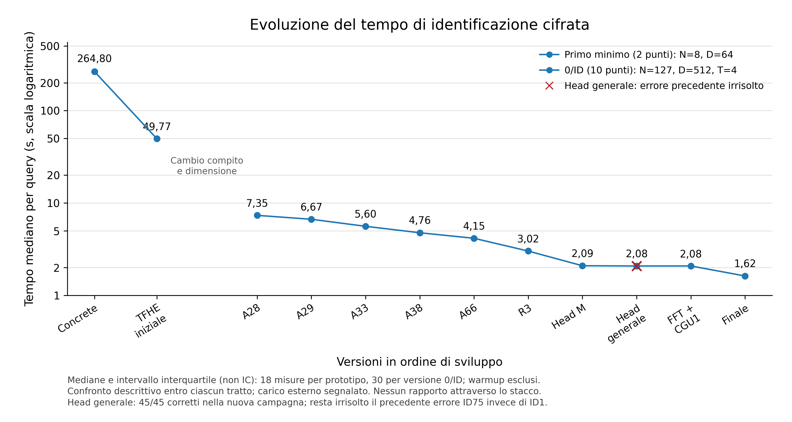

# Tesi-FHE — identificazione facciale con query cifrata

Progetto di ricerca sull'identificazione open-set **exact 0/ID**: il terminale
cifra la query, il server calcola il primo minimo e verifica la soglia di
quel vincitore. Il risultato decifrato è l'identità autorizzata oppure zero.

La documentazione raccoglie le prove concluse fino al **9 settembre 2026**,
inclusi i confronti del servizio e una successiva campagna comune dei core.
La ricerca resta aperta; risultati, errori osservati e limiti sono distinti.

- [Findings](findings.md): risultati verificati, con condizioni e limiti.
- [Esperimenti](experiments/README.md): percorso dai prototipi iniziali al core selezionato, inclusi i negativi.
- [Domande aperte](OPEN_QUESTIONS.md): obblighi irrisolti e possibili prossime prove.
- [Stato della ricerca](RESEARCH_STATE.md): riepilogo pubblico e limiti attuali.
- [Demo client/server](demo/dual_view/README.md): accesso sul client, galleria fotografica e gestione sul server.
- [Letteratura](letteratura.md): rassegna storica e fonti.
- [Riproducibilità e provenienza](docs/riproducibilita.md): contenuti pubblicati e archivi originali conservati localmente.

## Contratto esatto

Con indici della galleria da zero e soglie pubbliche per template:

```text
k = primo argmin_i score_i
output = k + 1  se score_k <= T_k
         0      altrimenti
score_i(q) = ||g_i||² - 2 <g_i, q>
```

Un template più lontano con soglia permissiva non autorizza una query rifiutata
dal vincitore. I pareggi favoriscono il primo indice. Il risultato non contiene
score, distanza o vettore dei match.

Il modello attuale assume un **terminale fidato** per acquisizione, embedding,
quantizzazione, validazione, cifratura e decifratura; il server è
honest-but-curious e conosce galleria e soglie. Il terminale ammette coordinate
in `[-3,3]` e norma quadrata al massimo 1024. Il dominio pubblico dei punteggi,
derivato anche dai template, deve contenere al massimo 4096 interi. Il server
non verifica il contenuto del probe cifrato: questi vincoli restano parte del
confine di fiducia, discusso nelle [domande aperte](OPEN_QUESTIONS.md).

## Implementazione selezionata

Il punto di ingresso è [22 — demo composita](experiments/22_demo_composita/README.md).
Comprende la [libreria Rust](experiments/22_demo_composita/runtime/core/src/lib.rs),
il servizio, il client immagini, l'interfaccia e la configurazione del contratto.
Usa TFHE-rs 1.7.0, Head con correzione media, PFKS direct-window, normalizzatori
condivisi, parallelismo classico e specializzazione delle costanti pubbliche.
La variante selezionata è `public_parallel`, senza G4, con 16 thread e FFT fissa.

Il profilo attuale è full51/low60: un GLWE contiene le due viste della query;
la risposta contiene **tre LWE, cifre in base 15**, ricostruite come
`low + 15*middle + 225*high`. La capacità rappresentativa è 3374 identità,
subordinata ai controlli di ammissione. Le taglie effettivamente verificate
sono riportate per ciascuna revisione; la capacità non è una prova FHE a ogni N.

La cartella [core/](core/README.md) conserva le utility Python/Concrete usate
dagli esperimenti storici. Il nuovo core Rust ha API e dipendenze diverse e
rimane nel pacchetto 22: non sostituisce le vecchie importazioni Python.

## Risultati principali

| Confronto | Risultato misurato | Ambito |
|---|---:|---|
| Core Head/PFKS M contro A126 | 25,60–50,97% di riduzione | Tre chiavi, 15 taglie comuni fino a N128; [18](experiments/18_scaling_soglie_miste/README.md) |
| Configurazione CGU1/16 contro FFT fissa/8 | 18,37% | Due famiglie di conferma sul core di quella campagna; [19](experiments/19_runtime_cpu/README.md) |
| Composizione pubblica/parallela B contro A | 6,596842% | 96 triple, due famiglie tenute fuori dallo screening; [22](experiments/22_demo_composita/README.md) |
| Nuovo servizio contro demo precedente | 24,710555% backend; 28,439223% richiesta immagini | Conferma: 32 e 12 coppie rispettivamente, dati sintetici; [22](experiments/22_demo_composita/README.md) |
| Composizione CKKS separata | 8,098% | 18 coppie, tre chiavi, stesso riferimento con cache pubblica; [23](experiments/23_ckks_ottimizzazioni/README.md) |

Sono confronti distinti: **le percentuali non si sommano**. Nella conferma
con immagini le mediane sono 2,820 e 2,011 secondi; la cattura della telecamera
è esclusa. Le prove conservano gli indicatori di carico esterno e non
stabiliscono una latenza universale né l'accuratezza sui volti personali.

PGO, condivisione dell'attraversamento PFKS, G4 aggiunto alla composizione,
Tetris con questa conversione e le politiche DAG provate hanno esiti negativi
nei rispettivi confronti. I [pacchetti degli esperimenti](experiments/README.md)
conservano anche questi sorgenti e risultati, senza estendere i negativi a
intere famiglie di algoritmi.

## Confronto comune del 9 settembre



La [figura con metodo e dati](output/figures/progressione-fhe/benchmark-comune-matplotlib-20260909/LEGGIMI.md)
presenta una nuova campagna, separata dai confronti precedenti. Il primo
tratto misura punteggi e primo argmin a N8/D64; il secondo misura il compito
0/ID a N127/D512/T4. **Non si confrontano le velocità attraverso lo stacco.**
Nel secondo tratto le mediane A28/finale sono 7,351781/1,622570 secondi;
la riduzione geometrica appaiata è 77,8052%, con 30/30 coppie favorevoli.
Sono tempi del calcolo cifrato, senza cattura, embedding o richieste HTTP.

La nuova campagna exact osserva 450/450 risultati corretti. Un precedente
tentativo rimane però fallito: **Head generale ha restituito ID75 invece
di ID1**, fra 269 risultati di cui 268 corretti. Il replay riproduce lo stesso
errore; la causa è irrisolta e i successivi 45/45 corretti di questa versione
non la risolvono. La croce rossa conserva il limite: il suo tempo è descrittivo
e non qualifica un miglioramento exact.

L'asse dei tempi è logaritmico e le barre sono intervalli interquartili,
non intervalli di confidenza. Tutte le versioni exact usano già 16 thread:
il punto FFT + CGU1 non misura il precedente passaggio da 8 a 16 thread.
Parametri nativi, chiavi e condizioni delimitano il confronto; tutte le
finestre misurate conservano segnalazioni di carico esterno. Non ne deriva
un limite formale alla probabilità di errore del circuito.

## Uso e provenienza

Le istruzioni pratiche e i requisiti sono nei README dei singoli esperimenti.
Per la versione selezionata partire dal [pacchetto 22](experiments/22_demo_composita/README.md).
Le copie includono sorgenti, lockfile, piccole tabelle pubbliche e riepiloghi.
Non includono chiavi, gallerie personali, fotografie biometriche, modelli o target di build.

Ogni pacchetto distingue i risultati ottenuti nella posizione originale
dai controlli di questa riorganizzazione. I manifest registrano gli hash e
le origini; non sostituiscono il replay dei grandi archivi cifrati, conservati
localmente. Non sono stati rieseguiti benchmark per impaginare il repository.
La [guida alla riproducibilità](docs/riproducibilita.md) spiega i controlli
pubblicati e i riferimenti agli originali. Gli archivi operativi, gli audit
completi e i documenti personali restano conservati localmente.
