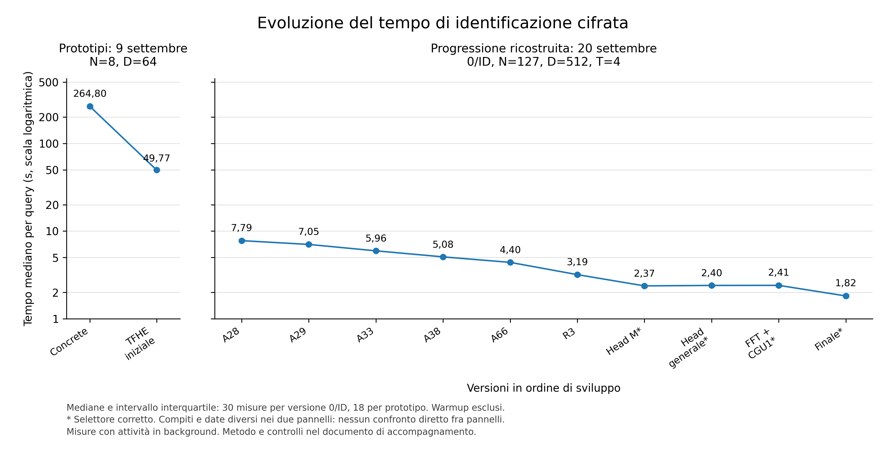

# Tesi-FHE: identificazione facciale con query cifrata

Questo progetto studia come cercare un volto in una galleria senza inviare
in chiaro la richiesta al server. Il client estrae dalla foto un vettore
numerico, lo quantizza e lo cifra. Il server confronta la query con la
galleria e restituisce un’identità cifrata oppure un rifiuto.
La cifratura omomorfa (**FHE**) permette di eseguire questi calcoli sui dati
ancora cifrati.

La ricerca segue due domande: quanto riconoscimento si conserva dopo la
quantizzazione e quanto costa prendere la decisione sul dato cifrato.
Il percorso comprende la rappresentazione del volto, il calcolo della
decisione in interi e il confronto fra circuiti Concrete, TFHE-rs e CKKS.

## Da dove iniziare

Per una prima lettura, seguire questo ordine:

1. [Percorso sperimentale](docs/percorso-sperimentale.md): dalla rappresentazione
   del volto alla decisione cifrata, con le scelte del circuito e le prove
   che le motivano.
2. [Risultati](findings.md): le conclusioni, i numeri e le prove che li sostengono.
3. [Letteratura](letteratura.md): il confronto con i lavori precedenti e la bibliografia.

Per cercare un file, usare la [mappa delle cartelle](#dove-si-trova-il-materiale)
qui sotto e la [mappa degli esperimenti](experiments/README.md), che collega
ogni campagna a guida, programmi e dati. Per provare l’applicazione,
passare direttamente alla [demo](#provare-la-demo).

<a id="come-funziona"></a>

## La decisione calcolata

Ogni template `g_i` è il vettore che rappresenta un volto nella galleria.
Il server calcola sul vettore cifrato della richiesta `q`:

```text
score_i(q) = ||g_i||² − 2〈g_i, q〉
k = primo argmin_i score_i(q)
risultato = k + 1, se score_k(q) <= T_k
            0, altrimenti
```

I pareggi favoriscono il primo indice. Si applica soltanto la soglia del
vincitore; un altro template più permissivo non può autorizzare la richiesta.
Il client ricostruisce zero o l’ID da tre valori cifrati, che rappresentano
le cifre del risultato in base 15. Sono cifrati LWE: l’
[esempio con due candidati e glossario](docs/come-funziona-il-confronto.md)
spiega il formato e segue il calcolo passo per passo.

<a id="modello-di-fiducia"></a>

Il client è fidato e gestisce foto, embedding e chiavi. Il server conosce
galleria e soglie e segue il protocollo; query e risposta sono cifrate.
La sicurezza contro client malevoli e la probabilità complessiva di errore
del runtime mantenuto restano [obblighi distinti](docs/limiti.md).

<a id="implementazione-selezionata"></a>

## Implementazione e risultati

Il lavoro integra la decisione cifrata completa e ne studia il costo
attraverso confronti sperimentali. La progressione delle implementazioni
e le prove dell’applicazione hanno carichi e tempi distinti.

<a id="risultati"></a>



**Progressione del circuito.** Con 127 template e vettori di 512 coordinate
(N127/D512), il tratto completo passa da 7,79 s a 1,82 s mediani nella campagna
TFHE-rs 1.7 su Apple M4 Max/16 thread. Sono tempi del core: embedding,
cifratura e HTTP sono esclusi. Il pannello iniziale misura un compito diverso.
[Dati e metodo](output/figures/progressione-fhe/selettori-corretti-20260920/LEGGIMI.md).

**Applicazione con 120 template.** Il
[servizio 1.8.1 a N120](docs/validazione/TEMPI_181_20261004.md)
richiede circa 1,88–1,90 s nei tre casi misurati; la
[demo con elaborazione della foto](docs/validazione/DEMO_SSE_20261004.md)
richiede 2,10–2,24 s dal POST al risultato SSE, esclusi avvio e cattura.
Qualità biometrica, correttezza sui cifrati provati e tempi sono verifiche separate.

Il [runtime mantenuto](runtime/README.md) usa TFHE-rs 1.8.1, Head/PFKS,
refresh del controllo di selezione, packing fino a quattro cifre, 16 thread
e FFT fissa; i [termini tecnici](docs/come-funziona-il-confronto.md#termini-usati-nei-readme)
sono spiegati nel glossario. I programmi usati nelle singole misure sono
conservati nei rispettivi pacchetti sperimentali.

<a id="demo"></a>

## Provare la demo

- [Demo web](demo/web/README.md): pagina unica con 120 ritratti d’esempio e galleria per sessione.
- [Demo client/server](demo/dual_view/README.md): due pagine, con galleria inizialmente vuota.

Le guide comprendono ambiente, modelli, chiavi e avvio; la
[guida Rust](BUILD_AND_RUN.md) descrive la compilazione del motore.
Nella demo web ospitata anche il client fidato gira sul server: l’operatore
può accedere a foto, template ed esiti. La separazione fra sessioni è applicativa.

<a id="struttura-e-lettura"></a>

## Dove si trova il materiale

| Cartella | Cosa contiene |
|---|---|
| [runtime/](runtime/README.md) | Motore attuale: [runtime/core/](runtime/core/) contiene il circuito Rust, [runtime/candidate/](runtime/candidate/) il servizio e [runtime/client/](runtime/client/) il client. |
| [demo/](demo/README.md) | Interfacce: [pagina unica](demo/web/README.md) in `demo/web/`, [due pagine](demo/dual_view/README.md) in `demo/dual_view/`. |
| [core/](core/README.md) | Utility Python/Concrete dei primi prototipi e dei benchmark. Il circuito Rust attuale è in `runtime/core/`. |
| [experiments/](experiments/README.md) | Programmi e risultati delle campagne, comprese le varianti scartate; l’indice permette di cercarle per argomento. |
| [benchmark/](benchmark/README.md) | Programmi di misura, campioni, analisi e generatori dei grafici. Le campagne sono collegate anche dall’indice degli esperimenti. |
| [docs/](docs/percorso-sperimentale.md) | Racconto del lavoro; approfondimenti in `docs/risultati/`, verifiche in `docs/validazione/`, fonti in `docs/letteratura/` e [questioni aperte](docs/limiti.md). |
| [output/](output/) | Figure e PDF esportati; le cartelle dei grafici contengono dati e metodo. Per rigenerarli seguire la [guida](docs/riproducibilita.md#grafici-correnti-e-rigenerazione-storica). |
| [tests/](tests/README.md) | Test e indicazioni sui loro prerequisiti; altri test sono accanto ai moduli che verificano. |
| [tools/](tools/README.md) | Strumenti per ricostruire i sorgenti delle campagne e verificare i file inclusi. |

Per capire perché una strada è stata scartata, leggere i
[tentativi, risultati negativi e correzioni](docs/risultati/alternative.md).
Per trovare una sigla come A108, usare il [catalogo dei tentativi](docs/risultati/catalogo-tentativi-a.md).
La [guida alla riproducibilità](docs/riproducibilita.md) raccoglie ambiente,
test e rigenerazione delle figure; [BUILD_AND_RUN.md](BUILD_AND_RUN.md)
descrive la compilazione del motore.

Per citare i programmi e i materiali, usare i metadati in [CITATION.cff](CITATION.cff)
e indicare il commit o il pacchetto sperimentale effettivamente utilizzato.
Le [attribuzioni e condizioni di riuso](THIRD_PARTY.md) distinguono codice,
modelli, dataset e fotografie; la licenza dei materiali originali è ancora da definire.
