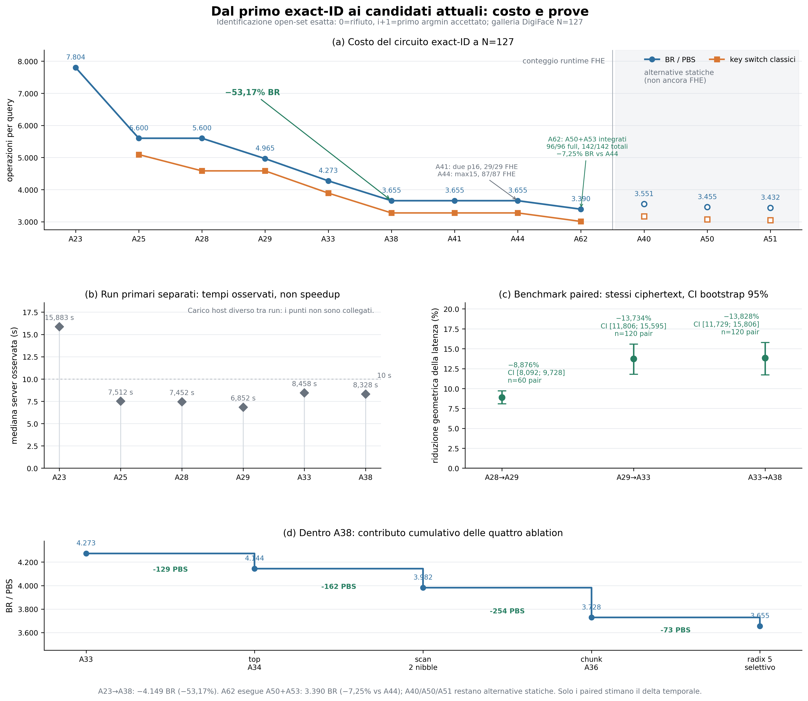

# Percorso di ottimizzazione exact-ID: guida alla figura

Data di congelamento: 2 settembre 2026.



La figura riassume le riduzioni di costo osservate mantenendo il contratto del sistema: il
server deve restituire **l'identita' esatta piu' vicina**, oppure `0` quando il minimo supera la
soglia. Non rappresenta quindi tecniche che calcolano soltanto il bit accept/reject.

La serie quantitativa parte da A23 perche' e' il primo circuito completo confrontabile con questo
contratto. A1--A22 erano esplorazioni, primitive o protocolli parziali: inserirne i secondi nella
stessa curva confonderebbe la riduzione della latenza con la differenza di funzione calcolata.

## Come leggere i quattro pannelli

1. **Costo strutturale.** A23--A38 sono pipeline osservate nelle suite FHE primarie; A41, A44 e
   A62 sono validazioni FHE di componente, mentre A40, A50 e A51 sono alternative statiche
   disegnate vuote. Da A23 ad A38 le blind rotation/PBS scendono da 7.804 a 3.655:
   **-53,165%**. A41 sostituisce l'uscita larga con due cifrati p16; A44 porta il limite nominale
   di rumore a 15; A62 materializza insieme A50+A53 e arriva a 3.390 BR/PBS, **-7,250%** rispetto
   ad A44. Questi sono conti di operazioni, non misure di secondi.
2. **Mediane dei run primari.** Ogni punto viene da una suite primaria separata. Serve a dare
   l'ordine di grandezza, ma i punti non sono collegati perche' furono eseguiti con carico host e
   condizioni diversi. In particolare, il fatto che A33 e A38 mostrino rispettivamente 8,458 s e
   8,328 s non misura correttamente il vantaggio causale di A38.
3. **Benchmark appaiati.** Qui le due revisioni ricevono gli stessi byte cifrati nello stesso
   blocco-chiave, con ordine bilanciato. Questi sono i confronti temporali utilizzabili:

   | passaggio | riduzione geometrica della latenza | CI 95% del run | coppie |
   |---|---:|---:|---:|
   | A28 -> A29 | 8,876% | [8,092%, 9,728%] | 60 |
   | A29 -> A33 | 13,734% | [11,806%, 15,595%] | 120 |
   | A33 -> A38 | 13,828% | [11,729%, 15,806%] | 120 |

   Il prodotto descrittivo delle tre stime corrisponde a circa **-32,261%**, cioe' **1,476x**,
   da A28 ad A38. Non e' pero' un singolo benchmark appaiato A28/A38 e non va presentato come un
   suo intervallo di confidenza.
4. **Ablation A33 -> A38.** La riduzione strutturale di 618 PBS e' composta da selezione top
   A34 (-129), scansione su due nibble (-162), chunk A36 (-254) e radix selettivo a cinque stati
   (-73). La cascata spiega da dove proviene il guadagno, senza attribuire a ogni singolo blocco
   una latenza misurata isolatamente.

## Risultati e limiti al 2 settembre 2026

- A38 ha preservato il codice exact-ID in tutte le 632 query della suite primaria e in tutte le
  144 coppie totali del paired, incluse 24 coppie di warm-up escluse dalle statistiche temporali.
- Nel paired misurato, A38 ha battuto A33 in 107/120 coppie e ha ridotto la latenza geometrica del
  13,828%.
- Il CI finale A33/A38 e' ancora largo 4,076 punti percentuali, oltre l'obiettivo preregistrato di
  2 punti. L'effetto e' chiaro nel campione, ma la precisione fra blocchi resta limitata.
- Il carico assoluto durante A33/A38 era alto e non stazionario. Per questo la figura non unisce
  le mediane dei run primari e non converte automaticamente i 3.655 PBS in una promessa di
  latenza idle.
- A38 e' ancora un **candidato**: il gate end-to-end Docker passa 3/3 ID esatti e 3/3 rifiuti, ma
  l'audit A56 ha lasciato aperto il failure budget crittografico. In particolare, A36 raggiunge
  raw L1=10 contro il massimo nominale 5 e il decode finale a `Delta=2^56` non ha ancora una coda
  provata. A40/A50/A51 non sono risultati runtime; A53 e' stato materializzato soltanto nel
  componente A62.
- A41 ha superato 25/25 fixture nel gate fail-closed e poi 29/29 nella suite FHE completa con una
  terza chiave effimera. Ricostruisce esattamente `code=low+16*high`, inclusi ID 127/128, rifiuto e
  pareggi. Ripara l'uscita terminale ma non il failure budget upstream, non riduce i gate e porta
  la risposta proiettata da 16.464 a 32.856 byte.
- A44 conserva exact-ID e i contatori A41, ma usa il preset Gaussian p16 max-15. Ha superato
  120/120 valutazioni complessive, incluse 87/87 nella suite completa ripetuta su tre chiavi.
  Questo contiene numericamente raw L1=10 senza rescaling, ma l'audit A60 mostra che l'API raw non
  eredita automaticamente il contratto `p-fail` shortint: il bound incondizionato resta `<=1`.
- A62 integra davvero sia la selezione A50 sia la scan/output A53. Ha superato 96/96 valutazioni
  nella suite completa su tre chiavi e 142/142 complessive su otto key-block dichiarati effimeri.
  A N=127 osserva 3.390 BR, 3.009 KS e 3.930 marginali e ricostruisce
  `code=low+15*high`, inclusi ID 60/64/127/128, rifiuto e pareggi. Resta una validazione di
  componente: servizio, primary, paired e bound `p-fail` raw non sono ancora chiusi.
- Questi dati documentano un miglioramento ingegneristico nel perimetro testato; da
  soli non dimostrano novita' scientifica rispetto alla letteratura.

Le alternative vuote hanno inoltre precondizioni diverse:

| candidato statico, N=127 | BR/PBS | KS | limite principale |
|---|---:|---:|---|
| A40 | 3.551 | 3.170 | sorgente Rust non eseguito; raw L1 oltre il max5 corrente |
| A50 | 3.455 | 3.074 | richiede il parametro A44 max15 e LUT custom ancora da provare |
| A51 | 3.432 | 3.051 | estende radix 15, sempre condizionato ad A44 |

A53 elimina una collisione reale incontrata nella codifica base 16. Il suo conto e' ora osservato
nel binario A62, ma il `-7,250%` rispetto ad A44 resta un delta **strutturale**, non temporale.
Il cambio di parameter set e l'adapter A53 possono cambiare il costo di ogni nodo: non si puo'
applicare quella percentuale agli 8,328 s del run primario A38.

## Dati sorgente congelati

| serie | artifact JSON | SHA-256 |
|---|---|---|
| primary A23 | `fhe_digiface_exact_primary_noise_bounded_2026-09-01.json` | `4a601d84b006e6fd8b3267c51b280f65e1fed017384c861e0dea0e4885dc016d` |
| primary A25 | `fhe_digiface_exact_primary_optimized_2026-09-02.json` | `1cef42ab0fa13ef8b7ef50ee80aeb6ca0d8c26a33535feefeded595a8ca2cf10` |
| primary A28 | `fhe_digiface_exact_primary_split4_2026-09-02.json` | `14ab4e07807744f547d4e042fc768202962e110322c4562cd21ae84d4b8b764d` |
| primary A29 | `fhe_digiface_exact_primary_manylut_2026-09-02.json` | `152e64280efcfec925e3638c3aefedd0c8ce1166df8e631b4831ef87b5099908` |
| primary A33 | `fhe_digiface_exact_primary_a33_2026-09-02.json` | `51be273a6a81274b1314f56af3a0ae62328131f035a7bff236d01b70751f9c49` |
| primary A38 | `fhe_digiface_exact_primary_a38_2026-09-02.json` | `ad44e627e0bae017643bf492bca5d055224bf07e67774b86eaf0066521d396b0` |
| paired A28/A29 | `fhe_digiface_exact_paired_a28_a29_2026-09-02.json` | `80e1a9e835434f0c4e8dcc023db30713e7aafd309e253796e377deb578c2d356` |
| paired A29/A33 | `fhe_digiface_exact_paired_a29_a33_2026-09-02.json` | `f24c767dc305419571deb740350a6cc19d995344cadabf7883bca1db8fc1e4ed` |
| paired A33/A38 | `fhe_digiface_exact_paired_a33_a38_2026-09-02.json` | `d12ac5ecdd5a7b8887ef315a0fbdb809d6159d17e478ba2dd63c5956c39fd0f9` |

La proiezione A53 nasce da un modello statico radix-15 con nove test.
Il modello standalone non è incluso nel clone; la successiva materializzazione
è descritta nel [rapporto del componente A62](../../experiments/14_pipeline_tfhe_rs/results/exact_id_a62_component_fhe_2026-09-02.md).
Questo riferimento documenta il passaggio alla verifica FHE senza trasformare
la proiezione statica in una misura di latenza.

Il punto A41 e' ancorato al gate
`exact_id_a41_component_gate_2026-09-02_gate01.json`, SHA-256
`e9b4f469d6070dbeb903ca2d6b34777e7016fa759c7c3c5138e6367d73f452d1`, e alla suite completa
`exact_id_a41_component_full_2026-09-02_run01.log`, SHA-256
`a603f5e6b646cac2d51b3466c1587dcbdf8fd2f0434b608d88bf8d57bc57b2ba`. Il report interpretativo
ha SHA-256 `f733c8476a3dcce756124f0decd28bc0d52407385d7e708c5b8931ed11b5f3ac`.

Il punto A44 e' ancorato al gate canonico richiesto-full
`exact_id_a44_component_gate_2026-09-02.json`, SHA-256
`3867c858d46bcbc55282d220596a8114f86098101e988e8d3b66f6d59813973b`, e al log completo
87/87, SHA-256 `921fea38c0fd6ca00af5fbe79812a04a677d5b002317ab744e3126f8de70fbec`.
Il report interpretativo e' `exact_id_a44_component_fhe_2026-09-02.md`.

Il punto A62 e' ancorato al gate canonico
`exact_id_a62_component_gate_2026-09-02.json`, SHA-256
`c82489b80dde17d2ea1c34484f9a03c33a9810f0ac629012a9d58e16f175938a`, e al log full
96/96, SHA-256 `13b9e9e20b4f03d6931b963f0f3220ba091ce2d8c90e016f4803e0a09767688e`.
Il report interpretativo e' `exact_id_a62_component_fhe_2026-09-02.md`.

Il generatore [`../figure_exact_id_improvements.py`](../figure_exact_id_improvements.py) verifica
prima di disegnare che ciascun run sia riuscito, che il numero di PBS coincida con quello atteso,
che le discrepanze clear/FHE siano zero e che ogni stima paired cada nel proprio intervallo.

| output | SHA-256 |
|---|---|
| generatore Python | `9ee7bf7fbdaad19796986b1e7116e675ac5a37fddd62e4cf579282555fb82c32` |
| PNG 300 dpi | `de3b536838161306f92d170432ae671f50daf64541f267412ddb66851440c686` |
| SVG | `94f5afbb68deaea85d78be80a9e792ddfcdfb160ab5cebc8514b7b583e5fcbb8` |

Rigenerazione:

```bash
uv run python benchmark/figure_exact_id_improvements.py
```

Gli hash dei JSON si riferiscono agli estratti pubblicati; la
[corrispondenza con gli originali](../../docs/provenienza-dati.json) conserva entrambe le impronte.
