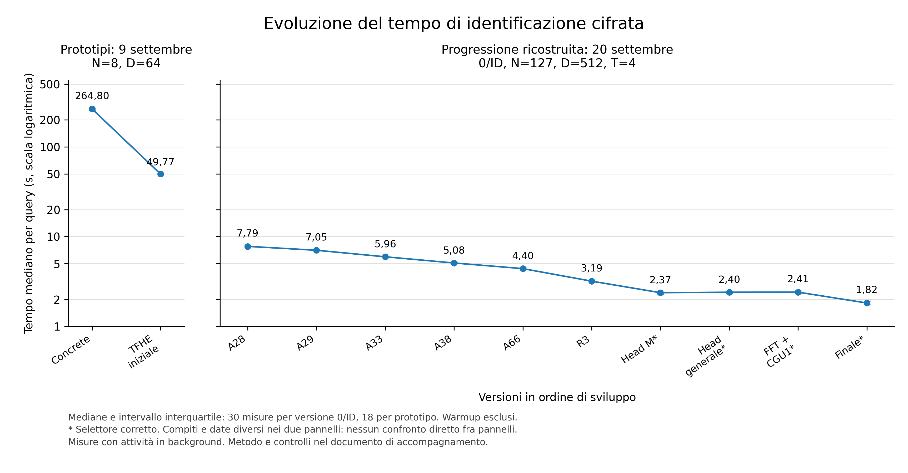

# Percorso sperimentale

La domanda iniziale è se un server possa riconoscere un volto senza ricevere
in chiaro la richiesta. La galleria resta visibile al server: il client
calcola l'embedding, lo quantizza e lo cifra. La ricerca studia sia quanto
riconoscimento si perde con questa trasformazione, sia quanto costa cercare
un'identità sul dato cifrato.

## Dai modelli di riconoscimento ai circuiti cifrati

I primi esperimenti confrontano PCA, descrittori locali e reti preaddestrate,
poi introducono cifratura e quantizzazione. I prototipi Concrete permettono
di eseguire il confronto completo e di individuarne il costo dominante:
selezionare il minimo e verificare la soglia. Il prodotto scalare con i
template in chiaro richiede operazioni lineari; confrontare valori cifrati
richiede invece circuiti più costosi.

Le misure biometriche e quelle del circuito rispondono a domande diverse.
Un risultato intero corretto può comunque derivare da un embedding che
riconosce male il volto. Le [prime schede](risultati/storico.md) raccolgono
questa parte del lavoro e le correzioni emerse durante lo sviluppo.

## Definire il risultato e costruire il torneo

Il contratto finale restituisce il primo minimo solo se supera il controllo
della propria soglia, altrimenti zero. Un'altra identità con una soglia più
permissiva non può autorizzare l'accesso. I pareggi favoriscono il primo indice.
La risposta contiene tre cifre cifrate che codificano l'ID, senza gli score.

La successione A28–R3 sviluppa il torneo e la selezione dell'uscita. Head/PFKS
estrae e trasferisce le cifre necessarie ai confronti; le versioni successive
estendono il supporto a soglie generali e diverse per iscritto.
[Core e scaling](risultati/core-e-scaling.md).

## Ridurre il costo e integrare la demo

La configurazione CPU, la FFT fissa, i normalizzatori condivisi, le costanti
pubbliche e il parallelismo riducono il lavoro del circuito. La composizione
integra questi interventi nel servizio usato dalla demo.
[Componenti e servizio](risultati/normalizzatore-e-demo.md).

Non tutti i tentativi migliorano il riferimento: PGO, alcune combinazioni
G4, Tetris con le conversioni provate e le politiche DAG restano documentati
nelle [alternative](risultati/alternative.md). Questi esiti spiegano le scelte
dell'implementazione, senza escludere altre costruzioni delle stesse famiglie.

## Correttezza del selettore e costo della correzione

Un errore osservato nella campagna del 9 settembre ha richiesto di riesaminare
il selettore. Head e confronto erano corretti, ma il controllo raggiungeva
l'indirizzo 341, oltre la finestra 300–340. Il selettore mescolava cifre di
posizioni diverse e il torneo restituiva ID75 invece di ID1.

La correzione rigenera il controllo prima della selezione. Il successivo
packing a quattro cifre riduce il numero di operazioni mantenendo il refresh.
La lezione è verificare insieme rumore, finestre e cifre trasportate: un'uscita
corretta nella demo non garantisce il margine su altre chiavi.
[Diagnosi e correzione](selector-repair-20260920.md).

Nel confronto diretto con l'originale del 19 settembre, il circuito corretto
richiede **il 6,87% di tempo in più**, circa **0,121 s** di differenza mediana
appaiata. Entrambe le versioni passano i casi di questa prova; il rischio
della versione originale non equivale a un errore osservato su ogni input.
L'intervallo condizionato alle tre famiglie riusate è +6,21%–+7,52%.
[Misure e limiti del confronto](selector-direct-cost-20260920.md).

## Risultati confrontabili

La progressione è stata ricostruita e rimisurata il 20 settembre, applicando
la correzione ai quattro stadi interessati: Head M, Head generale, CPU e
composizione finale. Gli altri sei mantengono il proprio circuito.

A N127/D512/T4, le mediane passano da **7,79 s a 1,82 s**; le 450 esecuzioni
includono 150 warmup e 300 misure. Il grafico usa 30 misure per versione e
mostra l'intervallo interquartile. Il pannello dei prototipi N8/D64 riguarda
un altro compito e non entra in questo confronto.
[Dati della progressione](../output/figures/progressione-fhe/selettori-corretti-20260920/LEGGIMI.md).

Il confronto CKKS/TFHE usa invece CKKS balanced-v3 e il circuito TFHE CPU
corretto, senza le aggiunte della demo finale. A N128 con soglia generale,
le mediane dei blocchi sono **3,41 s per CKKS e 2,60 s per TFHE**. CKKS
restituisce uno scalare approssimato, arrotondato sul client; TFHE tre cifre
discrete. Il tempo va letto insieme a questa differenza di contratto.
[Dati e metodo CKKS/TFHE](../output/figures/ckks-tfhe/selettore-corretto-20260920/LEGGIMI.md).

Le campagne usano Apple M4 Max e 16 thread, con carico esterno osservato.
Misurano il core, escludendo chiavi, cifratura, embedding e HTTP. La demo
corrente aggiunge anche la trasformazione anchor: il suo circuito è distinto
dal finale del grafico e dal TFHE del confronto CKKS. Le
[questioni aperte](limiti.md) riguardano rumore composto,
validazione biometrica e sicurezza del protocollo.
